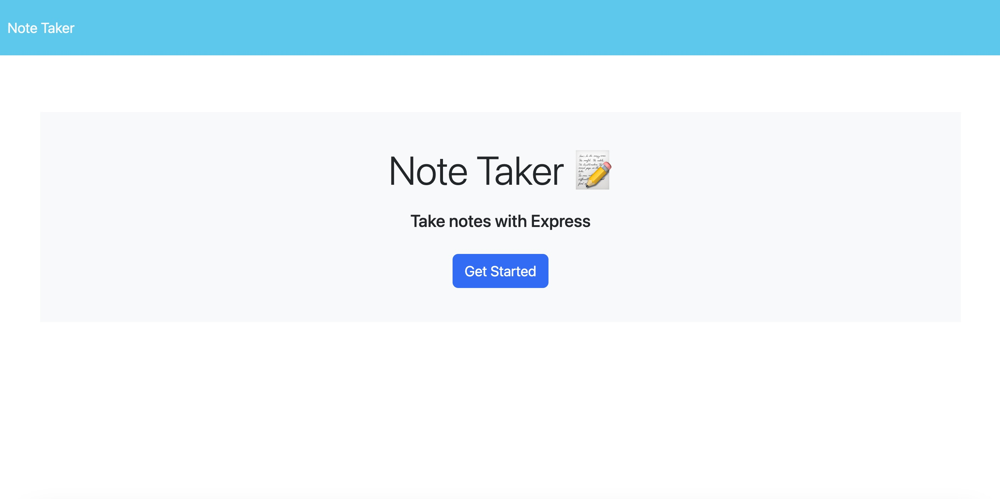

# taskmaster

## Technology Used 

| Technology Used | Resource URL | 
| ------------- |:-------------:| 
| HTML | [https://developer.mozilla.org/en-US/docs/Web/HTML](https://developer.mozilla.org/en-US/docs/Web/HTML) | 
| CSS | [https://developer.mozilla.org/en-US/docs/Web/CSS](https://developer.mozilla.org/en-US/docs/Web/CSS) | 
| Git | [https://git-scm.com/](https://git-scm.com/) | 
| Node | [https://developer.mozilla.org/en-US/docs/Glossary/Node.js](https://developer.mozilla.org/en-US/docs/Glossary/Node.js) |

## Description 
In this project I created an application using server and node.js, that allows users to enter, save and delete notes.

[Visit the Deployed Site](https://afternoon-fjord-75374-a13fb0ac8a5e.herokuapp.com/)

## Code Example 

 
app.use(express.json());
app.use(express.urlencoded({ extended: true }));
app.use(express.static('public'));

app.get('/', (req, res) => 
    res.sendFile(path.join(__dirname, '/public/index.html'))
);

app.get('/notes', (req, res) => 
res.sendFile(path.join(__dirname, '/public/notes.html'))
);

app.get('/api/notes', (req, res) => {
    readFromFile('./db/db.json')
    .then(data => res.json (JSON.parse(data)))
// res.json(db)
});

app.post('/api/notes', (req, res) => {
    // const newNote = req.body;
    // newNote.id = data.length + 1;

    const { title, text, id } = req.body;

//   if (req.body) {
    const newNote = {

        title, 
        text, 
        id: uuid(),
    }
 
  

    db.push(newNote);
    const noteString = JSON.stringify(db)

    // stringify data?

    fs.writeFile('./db/db.json', noteString, (err) => {

        if(err) {
            console.error('Error writing to db.json:', err);
        }
        res.json(db)
    })
})

The most difficult aspect of this challenge was the delete option. No matter what I did, the code I entered not only did not work but broke the application altogether. I finally spoke to my tutor who showed my pathing and the app.delete were not setup properly. I had app.deletNote, rather than app.delete.

app.delete ('/api/notes/:id', (req, res)=> {
    console.log('test')
 const noteId = req.params.id;
 readFromFile('./db/db.json')
 .then((db) => {
const jsonArray = JSON.parse(db)
 
    const result = jsonArray.filter(notes => (notes.id !== noteId));

    writeToFile('./db/db.json', result);

    res.json(`Item ${noteId} has been deleted`);
    console.log()
})
});

## Learning Points 

I learned quite a lot about utilizng routes, inquirer, and the process of storing data values in a file. It answered a number of questions that I'd never thought to ask regarding how information is stored when it isn't stored locally, which educated me on the complexities of removing said data. This will definitely inform ideas that I have for future ideas.

## Author Info
Armand Araujo
Age: 28
Location: Santa Barbara, CA

 
* [LinkedIn](https://www.linkedin.com/in/armand-araujo-a82ba2291/) 
* [Github](https://github.com/Armand57araujo) 

## Credits 